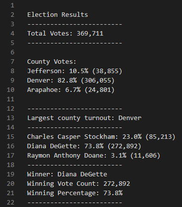

# Election_Analysis

## Project Overview
A Colorado Board of Elections employee has given us the following tasks to complete the election audit of a recent local congressional election.

1. Calculate the total number of votes cast.
2. Get a complete list of candidates who received votes.
3. Calculate the total number of votes each candidate received.
4. Calculate the percentage of votes each candidate won.
5. Determine the winner of the election based on popular vote.

## Resources
- Data Source: election_results.csv
- Software: Python 3.7, Visual Studio Code, 1.66.2

## Results
The analysis of the election show that:
- There were 369,711 votes cast in the election.

### County Data
County Votes:
    - Jefferson: 10.5% (38,855)
    - Denver: 82.8% (306,055)
    - Arapahoe: 6.7% (24,801)

Denver county reflected the highest voter turnout by count, having the largest number (306,055) of active voters.

### Candidate Data
Candidates:
    - Charles Casper Stockham
    - Diana DeGette
    - Ramon Anthony Doane
- The candidate results were:
    - Charles Casper Stockham received 23.0% of the vote and 85,213 votes.
    - Diana DeGette received 73.8% of the vote and 272,892 votes.
    - Raymon Anthony Doane received 3.1% of the vote and 11,606 votes.
- The winner of the election was:
    - Diane DeGette, who received 73.8% of the total vote and 272,892 votes.

## Summary

